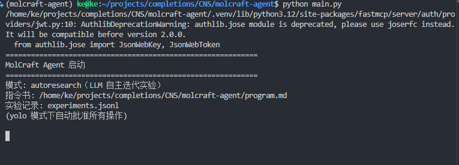
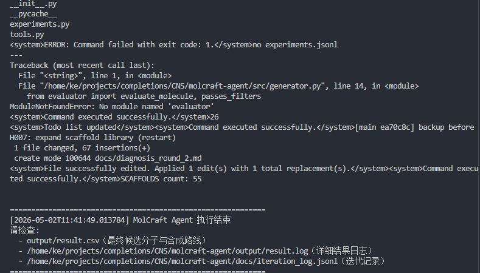
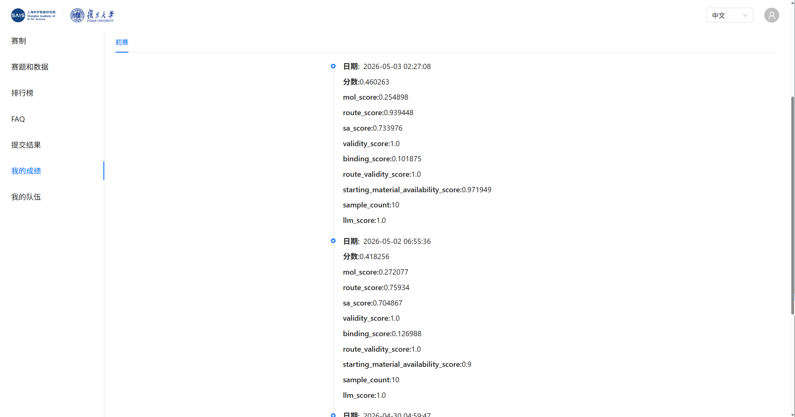

# 00 跑 Baseline：启动你的第一个自主科研 Agent

跟着做，30 分钟内拿到第一个由 Agent 自主产出的 **result.zip**。

---

## 环境配置

### 1. 安装 uv 并克隆代码

```bash
# 安装 uv（已安装则跳过）
curl -LsSf https://astral.sh/uv/install.sh | sh
source ~/.bashrc

# 克隆项目
git clone https://github.com/li-xiu-qi/molcraft-agent.git
cd molcraft-agent
```

uv 是 Python 包管理器，替代 pip + venv。安装后若找不到命令，执行 `export PATH="$HOME/.cargo/bin:$PATH"`。

### 2. 创建环境并安装依赖

```bash
uv venv --python 3.12
source .venv/bin/activate
uv sync --python 3.12
```

激活后命令行提示符会出现 `(.venv)`。uv sync 约 1 到 3 分钟，自动安装 RDKit、Vina、Meeko、Open Babel、科学计算包和 Agent SDK。

### 3. 验证环境

```bash
python check_env.py
```

全部 `✓` 即就绪。有 `✗` 则按提示修复后重试。

### 4. 配置 LLM

推荐用 Kimi CLI OAuth（零配置）：

```bash
kimi login
ls ~/.kimi/credentials/kimi-code.json   # 确认凭据存在
```

备选是 API Key：

```bash
export LLM_API_KEY="sk-your-key"
export LLM_BASE_URL="https://api.moonshot.cn/v1"
export LLM_MODEL="kimi-k2.6"
```

也支持 OpenAI、DeepSeek 等兼容 OpenAI 接口的模型。变量可写入 `.env` 文件持久化。

### 5. 确认靶点文件

```bash
ls data/target.pdb
```

不存在则把赛题提供的 target.pdb 复制到 data/。

配置检查清单：

- `python check_env.py` 全部通过
- LLM 配置完成（Kimi CLI 登录或 API Key 已设置）
- data/target.pdb 存在

---

## Agent 在做什么

### 4 阶段闭环

```
文献解析 -> 瓶颈诊断 -> 代码演进 -> 实验验证 ->（循环）
```

| 阶段 | Agent 行为 | 对应赛题能力 |
|------|-----------|-------------|
| 文献解析 | 读 papers/ 论文，提取改进思路 | 文献解析与逻辑解构 |
| 瓶颈诊断 | 读 src/ 代码，找瓶颈、提假设 | 瓶颈诊断与假设提出 |
| 代码演进 | 按最高优先级假设修改代码 | 自主设计与代码演进 |
| 实验验证 | 跑化学实验，判断假设是否成立 | 实验验证与科学迭代 |

### 核心文件

| 文件 | 作用 |
|------|------|
| **main.py** | 启动入口，只加载 program.md 并启动 Agent |
| **program.md** | Agent 指令书，定义工作流和迭代规则。改它即可调整 Agent 行为 |
| agent.yaml | 工具注册表 |
| src/ | 化学引擎（生成、对接、评估、逆合成） |
| papers/ | 参考论文 |
| docs/ | Agent 产出的分析报告 |

main.py 几乎零业务逻辑，所有决策在 program.md 里由 LLM 自主执行。

---

## 运行

### 启动

```bash
# 默认 1 次迭代，最长 90 分钟，每轮最多 1000 步
python main.py

# 3 次迭代
python main.py --iterations 3

# 最长 60 分钟
python main.py --max-minutes 60

# 每轮最多 500 步
python main.py --max-steps 500
```

你会看到类似输出：



```
============================================================
MolCraft Agent 启动
============================================================
模式: autoresearch（LLM 自主迭代实验）
指令书: /path/to/program.md
实验记录: docs/iteration_log.jsonl

[Agent] 开始执行启动检查...
[Agent] 确认 target.pdb 存在
[Agent] 确认 receptor.pdbqt 已准备
[Agent] 确认 papers/ 中有参考论文
[Agent] 启动检查完成，进入科研流程

--- 阶段一：文献解析与逻辑解构 ---
[Agent] 正在读取 papers/autonomous_agents_survey.md...
...
```

### 运行过程

一轮约 30 到 60 分钟：

1. 阶段一（5 到 10 分钟）：读论文，写 docs/literature_analysis_round_1.md
2. 阶段二（5 到 10 分钟）：读代码，诊断，写 docs/diagnosis_round_1.md
3. 阶段三（10 到 20 分钟）：改代码，写 docs/code_evolution_round_1.md
4. 阶段四（5 到 15 分钟）：跑实验，写 docs/experiment_round_1.md
5. 循环判断：成功则深化，失败则换方向

结束条件：

| 条件 | 默认 | 说明 |
|------|------|------|
| 迭代次数 | --iterations 1 | 达到次数自动退出 |
| 时间上限 | --max-minutes 90 | 防止单点卡住 |
| 步数上限 | --max-steps 1000 | 每轮最大工具调用步数 |

**yolo=True** 模式下 Agent 自动批准操作，全程无需人工干预。随时 Ctrl+C 中断，已产出的文件都会保留。

### 中断与恢复

Ctrl+C 中断后，下次运行 Agent 会从 docs/iteration_log.jsonl 读取历史，继续迭代。

运行结束时终端显示：



---

## 查看产出

### 化学结果

```bash
ls output/
# result.csv  result.log
```

result.csv 是最终提交文件：

```csv
mol_smiles,route
COC1=CC=C...,"reactant1.reactant2>>product1,..."
```

### Agent 科研证据

```bash
ls docs/
# literature_analysis_round_1.md
# diagnosis_round_1.md
# code_evolution_round_1.md
# experiment_round_1.md
```

这些文件是 Agent 自主科研能力的核心证据。评委通过 result.log 和这些文档判断 Agent 是否真实自主迭代。

### 结构化实验记录

```bash
cat docs/iteration_log.jsonl
```

每轮实验的完整记录（时间戳、假设、代码修改、实验结果），Agent 自己读取进行跨轮对比。

---

## 打包提交

```bash
cd output
zip result.zip result.csv result.log
```

上传 result.zip 到比赛平台。

result.log 必须包含 Agent 的完整执行记录。docs/ 下的文件不打包，但建议保留用于答辩。Agent 能力分数由评委根据 log 和实验记录综合判断。

---

## Baseline 实际表现

本项目三次提交的成绩如下：



| 日期 | 总分 | mol_score | route_score | binding_score | sa_score | llm_score | 说明 |
|------|------|-----------|-------------|---------------|----------|-----------|------|
| 04-30 | 0.386 | 0.267 | 0.664 | 0.115 | 0.755 | 0.5 | 首次 baseline，Agent 过程不完整 |
| 05-02 | 0.418 | 0.272 | 0.759 | 0.127 | 0.705 | 1.0 | 优化 program.md 后，Agent 能力分满分 |
| 05-03 | 0.460 | 0.255 | 0.939 | 0.102 | 0.734 | 1.0 | 扩充逆合成规则，route_score 大幅提升 |

趋势说明：llm_score 从 0.5 提升到 1.0，说明 Agent 自主科研过程的完整性直接决定能力分高低。route_score 从 0.664 提升到 0.939，说明扩充逆合成规则是有效的提分方向。binding_score 始终在 0.10 左右，是最大短板，需要重点突破。

---

下一步：[01 赛事解读与 Agent 工作流](01-understanding.md)
