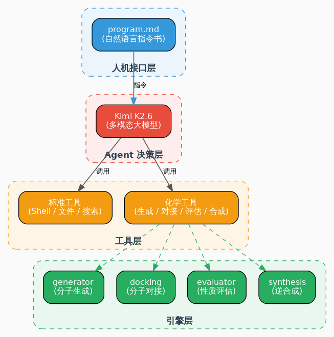
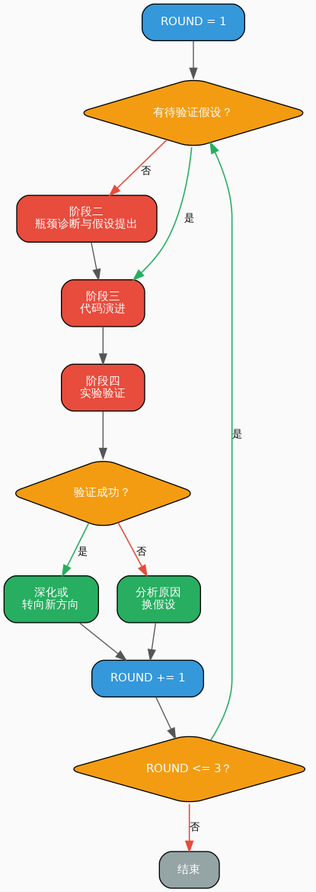
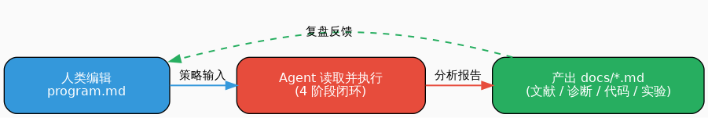
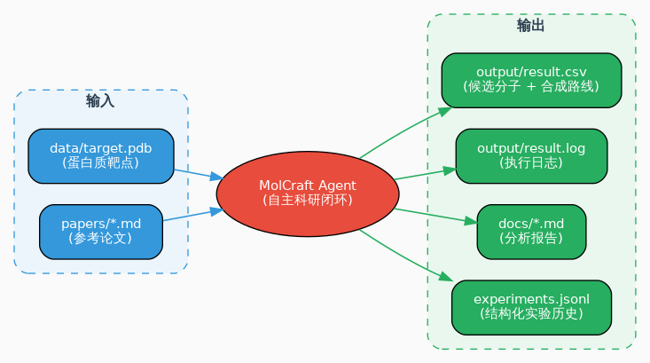

# 01 赛事解读：Agent 到底在做什么

Agent 启动后终端会输出大量内容：读了什么论文？诊断出什么瓶颈？改了哪几行代码？这一章把这些问题说清楚。

---

## 一、赛题本质

构建一个**自主科研 Agent**：给定蛋白质靶点，Agent 自主阅读文献、分析代码、提出假设、修改策略、跑实验验证、迭代优化，最终产出候选药物分子和合成路线。

输入是 data/target.pdb（蛋白质三维结构），输出是 result.csv（候选分子 + 合成路线）和 result.log（执行日志）。

评分采用双轨制：

| 轨道 | 评什么 | 占比 |
|------|--------|------|
| 化学结果 | 结合能、结构合理性、可合成性、路线质量 | 约 50% |
| Agent 能力 | 自主科研闭环完整度（读论文到诊断到改代码到验证到迭代） | 约 50% |

化学结果好但 Agent 能力弱，总分上不去。过程真实完整，即使化学指标一般，总分也有竞争力。这是和传统算法赛最大的区别。

---

## 二、Agent 架构

### 宏观架构



MolCraft Agent 四层架构：人机接口层到 Agent 决策层到工具层到引擎层。

核心原则：

| 原则 | 说明 |
|------|------|
| **main.py** 零业务逻辑 | 只加载 program.md 并启动 Agent |
| **program.md** 是唯一人机接口 | 编辑这一个文件即可调整 Agent 行为 |
| 工具即 API | LLM 通过自然语言描述调用工具 |
| 实验记录自动沉淀 | 每次工具调用自动写入 **docs/iteration_log.jsonl** |

### program.md 的设计

program.md 是 Agent 的指令书。直接写死代码逻辑会丧失灵活性，因为科研充满不确定性：Agent 可能发现 bug 需要修、读到新论文想换方向、假设验证失败要转向。自然语言让 LLM 根据上下文自主决策，比硬编码更适配科研的不确定性。

4 阶段结构对应赛题 4 个核心能力：

| 阶段 | 赛题能力 | 设计意图 |
|------|---------|---------|
| 文献解析 | 文献解析与逻辑解构 | 先建立知识储备，后续改进有据可依 |
| 瓶颈诊断 | 瓶颈诊断与假设提出 | 强迫先分析再动手，避免盲目尝试 |
| 代码演进 | 自主设计与代码演进 | 真正动手改代码，展现自主能力 |
| 实验验证 | 实验验证与科学迭代 | 量化验证，用数据说话 |

4 阶段的推荐顺序是：先读文献建立认知，再诊断找问题，再动手改代码，最后验证。这个顺序在 program.md 中作为建议流程给出，目的是让 Agent 的改进有文献支撑。但实际运行中 Agent 也可能跳过某个阶段或调整顺序，评分更看重的是 Agent 是否展现出自主分析、自主决策、自主迭代的能力，而不是是否严格遵循了某个固定流程。

迭代循环流程：



3 轮上限基于比赛时间设定，每轮约 30 到 60 分钟。

program.md 中的硬性约束（行为准则，非逻辑规则）：

一次只改一个假设，归因清晰，指标变化能判断是哪个改动带来的；每次修改前 git commit 备份，LLM 可能改崩代码，有备份才能回退；禁止只改超参数，调 n_generate 从 50 改到 100 不叫代码演进；禁止伪造实验结果，失败假设同样有价值。这些写在 program.md 里由 LLM 自主遵守，比代码强行限制更灵活。

### 为什么选 Kimi K2.6

| 能力 | 作用 |
|------|------|
| 代码能力 | 准确理解 src/ 代码，提出合理修改方案 |
| 多模态 | 直接理解论文中的图片、图表、分子结构图 |
| 长上下文 | 一次性加载多篇论文 + 全部代码 + 历史记录 |
| 生态便利 | kimi-agent-sdk 提供完整工具调用框架，yolo=True 自动批准操作 |

### 工作机制

**autoresearch** 架构：人类只写高层指令（program.md），LLM 自主执行全部低层操作。人类不逐行审阅每一次操作，只在策略层面通过编辑 program.md 干预。

main.py 零业务逻辑的好处：一是人机解耦，换模型、换工具、换流程都不需要改 main.py；二是可解释性，所有决策过程输出在终端和 result.log，可完整复盘。

yolo=True 让 Agent 自动批准操作，无需人工逐条确认。科研迭代需要快速试错，等人工确认跑不完 3 轮。缓解措施有三：program.md 约束降低乱改概率、修改前自动 git commit 备份、--max-minutes 防无限运行。

工具调用链：LLM 生成意图，SDK 路由到 Tool 类，Tool 调用 src/ 引擎，结果返回 LLM。中间层提供参数校验（Pydantic）、异常隔离（ToolError）、自动记录（docs/iteration_log.jsonl）。

docs/iteration_log.jsonl 是 Agent 的记忆，每轮迭代追加一条 JSON 记录。Agent 下一轮读取对比历史数据判断假设是否成立。JSON Lines 格式追加写入 O(1)，损坏一条不影响其他。

### 各层展开

人机接口层只有 program.md。人类编辑，Agent 读取执行，产出 docs/*.md，人类复盘。循环往复。



工具层分两类。标准工具包括 Shell、ReadFile、WriteFile、StrReplaceFile、Glob、Grep、SearchWeb、Think 等。化学工具定义在 molcraft_agent/tools.py：

| 工具 | 功能 | 对应引擎 |
|------|------|----------|
| generate_molecules | 生成候选分子 | src/generator.py |
| dock_molecules | 批量分子对接 | src/docking.py |
| evaluate_molecule | 评估药物性质 | src/evaluator.py |
| plan_synthesis | 规划逆合成路线 | src/synthesis_v2.py |

引擎层包括：generator.py（RDKit 骨架变异，55 个药物骨架，QED/Lipinski/SA 过滤）、docking.py（SMILES 到 3D 构象到 PDBQT 到 AutoDock Vina）、evaluator.py（QED、MW、LogP、TPSA、SA score、Lipinski）、synthesis_v2.py（35+ SMARTS 反应模板，BRICS 回退）。

数据层：



输入是 data/target.pdb（赛题靶点）和 papers/*.md（参考论文）。输出是 output/result.csv（提交文件）、output/result.log（执行日志）、docs/*.md（分析报告）、docs/iteration_log.jsonl（结构化实验历史）。

---

## 三、4 阶段闭环详解

### 阶段一：文献解析

Agent 读取 papers/ 论文，提取可落地的改进思路，输出 docs/literature_analysis_round_X.md。K2.6 的多模态能力可以同时处理文字和图片信息。

### 阶段二：瓶颈诊断

Agent 读取 src/ 全部代码，对比文献找差距，提出具体、可验证、低风险的假设，输出 docs/diagnosis_round_X.md。

假设格式示例：

```
假设ID: H001
瓶颈: generator.py 骨架库只有 27 个，多样性不足
文献支撑: MOOSE-Chem 使用假设驱动的分子生成
改进方案: 从文献中提取 10 个高频药物骨架扩充库
验证指标: 平均 QED 提升、top 10 平均结合能改善
风险: 低（只改列表，不动生成逻辑）
```

### 阶段三：代码演进

选择最高优先级假设，git commit 备份后用 StrReplaceFile 或 WriteFile 精确修改，语法检查加导入测试后输出 docs/code_evolution_round_X.md。

约束：一次只改一个假设；保留现有接口；添加注释说明修改目的和文献来源。

### 阶段四：实验验证

调用化学工具运行实验，收集结合能、QED、SA score、逆合成成功率等指标，与历史数据对比判断假设是否成立，输出 docs/experiment_round_X.md，追加记录到 docs/iteration_log.jsonl。

验证成功则标记 VERIFIED，选择深化或转向；验证失败则标记 REJECTED，分析原因换假设。

---

## 四、底层化学引擎

分子生成（src/generator.py）：从 55 个药物骨架中随机选择，做 1 到 4 次变异（加取代基、换原子、删末端、插连接子），过滤条件是分子量 150 到 500、logP 小于 5、QED 大于等于 0.3、SA 小于 8、Lipinski 最多违反 1 条。Agent 可改进的方向包括扩充骨架库、口袋感知定向生成、换扩散模型、基于高分分子特征定向变异。

分子对接（src/docking.py）：SMILES 经 RDKit 3D 构象，Meeko 转 PDBQT，AutoDock Vina 打分。对接盒子中心在 config.py 中预设为 [18.28, 2.31, 21.44]。Agent 可改进自动检测活性口袋坐标、调整盒子大小、多构象采样。

逆合成（src/synthesis_v2.py）：35+ 条 SMARTS 反应模板，匹配失败回退到 BRICS 碎片化，再失败输出 trivial route（自己生成自己，0 分）。Agent 可改进扩充规则库、LLM 评审路线可行性、优化规则优先级。

---

## 五、评分维度

| 维度 | 权重 | 说明 |
|------|------|------|
| 结合能 | 高 | Vina 打分，越负越好。-7 以下不错，-9 以上优秀 |
| 结构合理性 | 中 | QED、Lipinski、毒性等 |
| 可合成性 | 中 | 逆合成路线是否真实可行 |
| 起始原料可及性 | 中 | 起始原料是否容易买到 |
| 合成路线经济性 | 低 | 步骤多少，是否简洁 |
| Agent 自主能力 | 高 | 读论文、诊断、改代码、迭代的能力 |

Agent 能力评分依据有 6 项：result.log 里的时间戳和步骤记录；docs/literature_analysis_round_X.md 是否读了论文并提取有价值方法；docs/diagnosis_round_X.md 的假设是否具体、可验证、有文献支撑；docs/code_evolution_round_X.md 的代码修改是否精准、有注释、保留接口；docs/experiment_round_X.md 的实验设计是否严谨、对比是否清晰、决策是否合理；docs/iteration_log.jsonl 的完整结构化实验历史。

---

## 六、Baseline 的典型短板

| 评分维度 | 典型分数 | 短板 |
|----------|---------|------|
| 结合能 | 0.127 | 生成策略盲目，没利用口袋信息。最大提分空间 |
| 分子质量 | 0.272 | 骨架库太小，过滤偏松 |
| 路线质量 | 0.759 | 35+ 规则仍有盲区，部分 trivial route |
| 合成可及性 | 0.705 | 部分分子过于复杂 |
| 起始原料可及性 | 0.9 | 大部分起始原料简单可及 |
| Agent 能力 | 取决于过程 | 过程越完整、迭代越有逻辑，分数越高 |

化学指标的提升由 Agent 自主发现和实现。你的角色是设计好 program.md 和实验框架，让 Agent 有能力自主改进。Agent 能力的分数是过程分，化学指标的分数是结果分，两者相辅相成。

---

下一步：[02 让 Agent 迭代得更有效](02-improvement.md)
